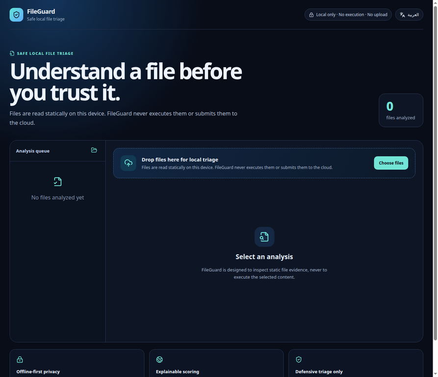
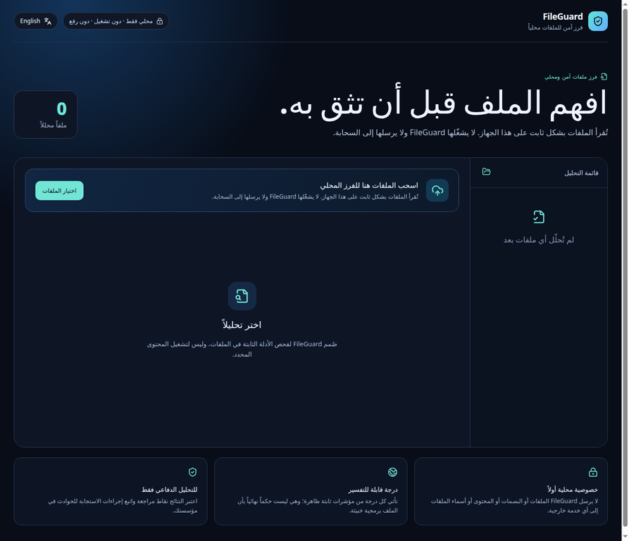

# FileGuard

> **Safe local file triage, without execution or automatic upload.**

[](https://github.com/9gkc/FileGuard/releases/latest)
[](https://github.com/9gkc/FileGuard/actions/workflows/quality.yml)
[](LICENSE)
[](docs/RESPONSIBLE_USE.md)

FileGuard is a bilingual desktop tool that helps students, IT teams, and defenders review suspicious files without opening or running them. It identifies common file signatures, calculates SHA-256, inventories ZIP-compatible archives without extracting them, checks for filename deception, locates selected static indicators, and creates explainable reports in **Arabic** or **English**.

## Download and explore

| Option | Link |
| :--- | :--- |
| **Windows x64 installer** | [Download FileGuard v1.0.0](https://github.com/9gkc/FileGuard/releases/download/v1.0.0/FileGuard-1.0.0-win-x64.exe) |
| **Latest release notes and verification hash** | [Open the release page](https://github.com/9gkc/FileGuard/releases/latest) |
| **Safe operating boundaries** | [Read Responsible Use](docs/RESPONSIBLE_USE.md) |

> Windows may display a SmartScreen warning because the first public release is not code-signed. Always download from this repository’s official release page and validate the published SHA-256 before installation.

## Interface preview

The screenshots below are taken from the running application, not generated mockups. They show the local-triage workspace before a user selects a file, which accurately represents FileGuard’s privacy-first behavior.

### English interface



### واجهة عربية



## What FileGuard does

| Capability | Defensive outcome |
| :--- | :--- |
| Signature-based type detection | Reveals when a file’s actual header differs from its filename extension. |
| SHA-256 | Preserves a stable local identifier for an incident ticket or evidence record. |
| Filename review | Detects document-plus-executable double extensions and direction-control characters. |
| Archive inventory | Lists ZIP entries without extracting them and flags executable entries or Office macro projects. |
| Bounded static inspection | Looks for selected PDF action markers and script patterns in a limited byte window. |
| Explainable scoring | Shows the score contribution and evidence for each finding; it never claims a verdict. |
| Local reports | Exports Markdown, JSON, or self-contained HTML without cloud submission. |

## Important boundary

FileGuard **does not execute files**, detonate samples, decrypt archives, upload data, or automatically query a reputation service. A finding is a prompt for safe human review, not proof that a file is malicious. Read the full [responsible-use policy](docs/RESPONSIBLE_USE.md) before relying on the output.

## Run from source

```bash
pnpm install
pnpm dev
```

Run the deterministic test suite and generate a renderer build:

```bash
pnpm test
pnpm build
```

For a Windows desktop package, run `pnpm package:win` on Windows or use the **Windows release** workflow. The project is intentionally designed so that a Windows build can be created by GitHub Actions without handing suspicious files to an external analysis backend.

## Analysis policy

The analysis core opens selected files for reading only. It never invokes a selected file, renders a document, extracts an archive to disk, or transfers data to the network. See [Architecture](docs/ARCHITECTURE.md) for the process separation and [Responsible Use](docs/RESPONSIBLE_USE.md) for the operational guidance.

## Development status

The initial implementation focuses on Windows-oriented file types while keeping the core portable. The user interface supports Arabic right-to-left rendering and English left-to-right rendering. Release packaging is configured for Windows, and source-level analysis and reports work wherever supported Node.js and Electron are available.
